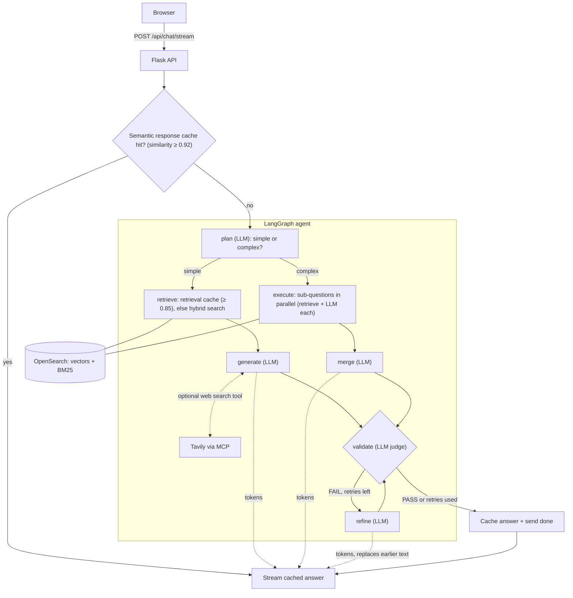
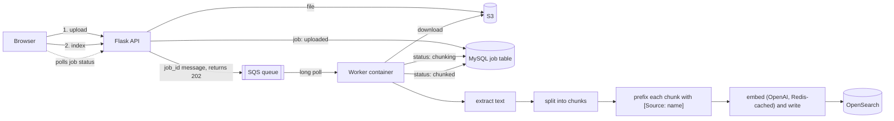

# KnowledgePilot

A production agentic RAG system on AWS. Upload documents, ask questions, and get streamed, grounded answers.

**Live demo:** https://knowledgepilot.dev

## What it does

- Ingests PDF, DOCX, TXT, Markdown, and HTML files into a searchable knowledge base.
- Answers questions with a LangGraph agent that plans, retrieves, writes, validates, and refines.
- Streams answers token by token, with live progress status.

## System design

The system has two paths. **Chat is synchronous** because the user is waiting. **Document processing is asynchronous** because embedding is slow and shouldn't block the web server.

### 1. Chat path (synchronous, streamed)



- **LLM calls:** one to plan, one to write the answer (`generate`, or one per sub-question plus `merge` for complex questions), one to validate, and up to a configurable number to refine.
- **Semantic caches:** a cached result is used only when the query's embedding similarity passes a threshold (0.92 for final answers, 0.85 for retrieved chunks). Every lookup embeds the query, and those embeddings are cached in Redis.
- **Hybrid search:** dense k-NN and BM25 results are merged with reciprocal rank fusion.
- **Web search** is optional and only active when a Tavily key is configured.
- **Streaming:** only the nodes that write the answer (`generate`, `merge`, `refine`) are streamed. Planner and judge output stays internal. If validation fails, the client replaces the text with the refined answer.

### 2. Document path (asynchronous)



- The API only stores the file and queues a message, so it returns immediately.
- The `[Source: …]` prefix makes the document's name searchable, since a chunk's own text often doesn't contain it.
- The worker is idempotent: it skips finished jobs, and a job stuck in `chunking` for over 10 minutes is retried. A failed message reappears on the queue after the visibility timeout.

### Infrastructure

```
Browser ──HTTPS──> Nginx (React build + reverse proxy) ──> Flask + Gunicorn (EC2)
                                         Worker container (EC2) <── SQS
Data: OpenSearch · MySQL (RDS) · S3 · ElastiCache (Redis)       LLM: OpenAI
```

**Stack:** Python 3.12, Flask, Gunicorn, LangChain, LangGraph · React, TypeScript, Vite · OpenAI · OpenSearch · MySQL · ElastiCache · S3 · SQS · EC2, Docker Compose, Nginx, Let's Encrypt

## Design decisions

| Decision | Why |
|---|---|
| Async ingestion through SQS | Embedding and indexing take seconds to minutes. Keeping them out of the web workers keeps chat responsive on a small instance. |
| Two semantic caches (answers and retrieved chunks) | Repeat questions return in ~0.5 s and skip the LLM entirely; similar questions skip retrieval. |
| Hybrid search (vector + BM25) | Dense search alone missed exact terms; keyword search alone misses paraphrases. |
| Sub-questions on one shared, bounded thread pool | The work is network-bound, so threads work despite the GIL. A single pool caps concurrency no matter how many users are active. |
| Stream only the answer-writing nodes | Showing planner or judge output would confuse users. The non-streaming endpoint stays as a fallback. |
| Two stores: OpenSearch for retrieval, MySQL for job state | OpenSearch handles vector, keyword and cache lookups. Ingestion status needs reliable row updates and simple queries by state, which a search index handles poorly. |
| Validate-then-refine with capped retries | A judge checks each answer against the retrieved context, so confident answers from irrelevant chunks get caught. The cap bounds latency and LLM cost. |

## Challenges

- **Retrieval missed a document it had indexed.** A question about a specific uploaded document returned unrelated results. The chunks never contained the document's title, which lived only in filename metadata. Fix: prepend a `[Source: …]` line to each chunk before embedding, add BM25 over text and source (boosted 3×), and re-ingest.
- **Running on a 1 GB instance.** Worker processes were killed for running out of memory. Fix: moved Redis to ElastiCache, added swap, and ran one Gunicorn worker with threads and a 120 s timeout. Multi-part questions dropped from ~30 s to ~15 s with parallel sub-questions.

*Timings are single runs from request logs, not benchmarks.*

## Run locally

Requires an OpenAI key and AWS resources (OpenSearch, MySQL, S3, SQS; Redis optional).

```bash
cd backend && cp .env.example .env   # fill in keys and service URLs
pip install -r requirements.txt
python run.py        # API on :5050
python worker.py     # ingestion worker (second terminal)

cd frontend && npm install && npm run dev
```

## Limitations and next steps

Single `t3.micro` with no autoscaling (next: ECS/Fargate behind a load balancer) · no dead-letter queue, so a document that can never be processed is retried indefinitely · no OCR for scanned PDFs · no authentication · no automated test suite
